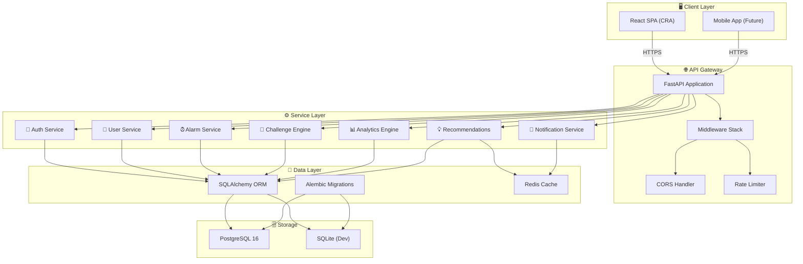
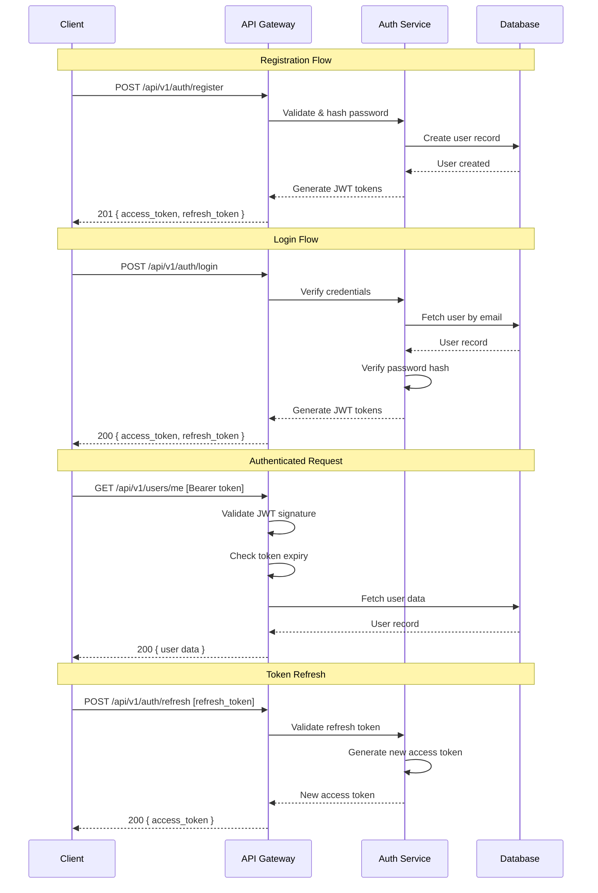
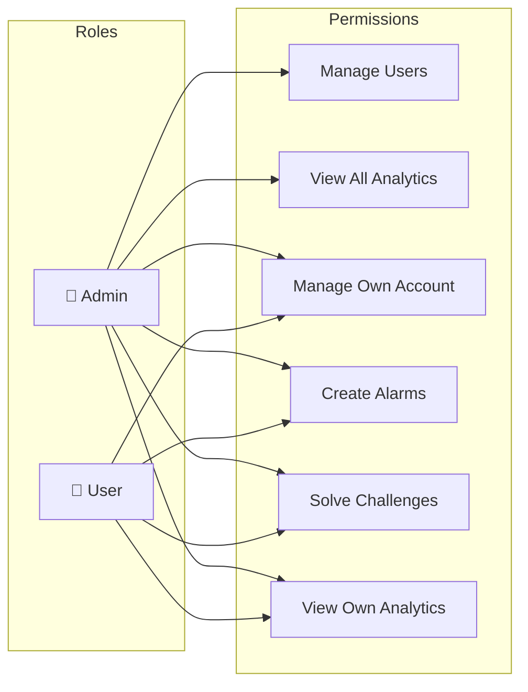
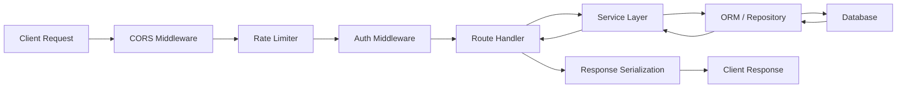
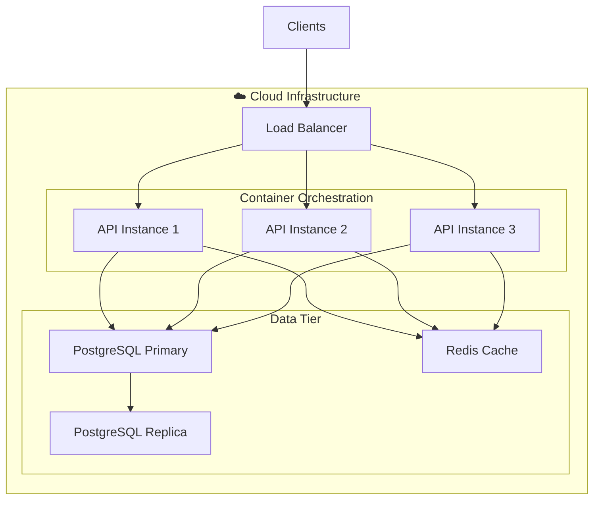

# 🏗️ Architecture Documentation

## Intelligent Cognitive Alarm Platform (ICAP)

---

## 1. System Overview

The Intelligent Cognitive Alarm Platform is built using a **modular monolith** architecture. While all services currently reside within a single deployable unit, they are organized into distinct, loosely-coupled modules that can be extracted into independent microservices as the platform scales.

This approach gives us:

- **Simplicity** — Single deployment unit during early development
- **Modularity** — Clean boundaries between domains for future extraction
- **Performance** — No inter-service network overhead in the early stages
- **Evolvability** — Clear path to microservices when scaling demands it

---

## 2. System Architecture Diagram



---

## 3. Component Descriptions

### 3.1 API Gateway (FastAPI)

The API Gateway is the single entry point for all client requests. Built on **FastAPI** with **Uvicorn** as the ASGI server, it handles:

- **Request routing** — Directs requests to the appropriate service module
- **Authentication** — JWT validation via middleware
- **Rate limiting** — Prevents abuse and ensures fair usage
- **CORS** — Configurable cross-origin resource sharing
- **Request validation** — Automatic Pydantic-based input validation
- **API versioning** — URL-based versioning (`/api/v1/...`)
- **Documentation** — Auto-generated OpenAPI/Swagger docs

### 3.2 Auth Service

Handles all authentication and authorization concerns:

| Responsibility         | Implementation                     |
| ---------------------- | ---------------------------------- |
| User registration      | Email validation, password policy  |
| Login                  | Credential verification            |
| Token issuance         | JWT access + refresh tokens        |
| Token refresh          | Rotating refresh tokens            |
| Password hashing       | bcrypt via passlib                 |
| Role-based access      | Admin / User role guards           |

### 3.3 User Service

Manages user accounts and profiles:

- CRUD operations on user records
- Profile management (display name, avatar, preferences)
- Account settings and preferences
- Admin user management

### 3.4 Alarm Service *(Milestone 2)*

Core alarm management functionality:

- Alarm CRUD operations
- Recurring alarm schedules (daily, weekday, custom)
- Snooze policies and limits
- Alarm-to-challenge linking
- Timezone-aware scheduling

### 3.5 Challenge Engine *(Milestone 3 — Implemented)*

Cognitive challenge generation and evaluation:

- Multiple challenge types (math, logic, memory, pattern, word, riddle, quiz)
- Per-alarm and profile difficulty preference (`beginner` → `expert`)
- Attempt logging via `alarm_challenge_logs` (queryable + `/alarms/challenge/log-health` audit)
- Rule-based adaptive difficulty: raise after N consecutive successes, lower after N consecutive failures (±1 around adapted baseline; user preference is never overwritten)

### 3.6 Analytics, Habit Score & Recommendations *(Milestone 3 — Implemented)*

Behavioral analytics and coaching (rule-based; deeper ML personalization remains later):

- Analytics ingestion: `POST /analytics/events` (+ batch) and summary reads
- Behavioral analytics (pandas/numpy): snooze patterns, wake consistency, sleep adherence, trends
- Weighted habit score SSOT (35% wake consistency / 25% challenge completion / 20% snooze reduction / 20% sleep adherence)
- Recommendation engine: sleep / wake / habit / productivity suggestions (`GET /recommendations*`)
- Redis cache for recommendation results (TTL + invalidation on preference changes)

### 3.7 Notification Service *(Milestone 6)*

Multi-channel notification delivery:

- Push notifications (mobile)
- Email notifications
- In-app notifications
- Notification preferences management

---

## 4. Authentication Flow



---

## 5. Security Architecture

### 5.1 JWT Token Strategy

| Token Type      | Lifetime   | Storage          | Purpose                    |
| --------------- | ---------- | ---------------- | -------------------------- |
| Access Token    | 30 minutes | Memory / Header  | API authentication         |
| Refresh Token   | 7 days     | HTTP-only cookie | Access token renewal       |

**Token Payload (Claims):**

```json
{
  "sub": "user-uuid",
  "email": "user@example.com",
  "role": "user",
  "exp": 1719849600,
  "iat": 1719847800,
  "jti": "unique-token-id"
}
```

### 5.2 RBAC Model



### 5.3 Security Measures

| Measure                  | Implementation                                    |
| ------------------------ | ------------------------------------------------- |
| Password hashing         | bcrypt with cost factor 12                        |
| Token signing            | HMAC-SHA256 (HS256)                               |
| Input validation         | Pydantic v2 with strict types                     |
| SQL injection prevention | SQLAlchemy parameterized queries                  |
| CORS                     | Configurable allowed origins                      |
| Rate limiting            | Per-IP and per-user rate limits                   |
| HTTPS                    | Enforced in production via reverse proxy          |
| Password policy          | Minimum 8 chars, mixed case, numbers              |

---

## 6. Data Flow

### 6.1 Request Lifecycle



### 6.2 Data Validation Flow

1. **Transport** — Raw HTTP request received by Uvicorn
2. **Deserialization** — FastAPI parses JSON body
3. **Validation** — Pydantic schema validates and coerces types
4. **Authorization** — JWT middleware checks permissions
5. **Business Logic** — Service layer applies domain rules
6. **Persistence** — SQLAlchemy ORM maps to database operations
7. **Serialization** — Pydantic response model shapes output
8. **Transport** — JSON response sent to client

---

## 7. Technology Stack Justification

| Choice          | Reasoning                                                                 |
| --------------- | ------------------------------------------------------------------------- |
| **FastAPI**     | Async-native, automatic OpenAPI docs, Pydantic integration, high perf     |
| **SQLAlchemy**  | Industry-standard ORM, excellent migration support, multi-DB compatibility |
| **PostgreSQL**  | ACID compliance, JSON support, full-text search, proven scalability       |
| **Pydantic v2** | Rust-powered validation, 5-50x faster than v1, strict type checking      |
| **Alembic**     | Tight SQLAlchemy integration, autogenerate migrations, version control    |
| **Docker**      | Consistent environments, easy scaling, CI/CD integration                  |
| **python-jose** | Well-maintained JWT library with multiple backend support                 |
| **passlib**     | Secure password hashing with bcrypt, automatic salt generation            |

---

## 8. Database Architecture

### 8.1 Connection Management

- **Development:** SQLite with synchronous driver
- **Production:** PostgreSQL 16 with connection pooling via SQLAlchemy
- **Migrations:** Alembic with autogenerate support
- **Connection pool:** Default pool size of 5, max overflow of 10

### 8.2 Multi-Environment Strategy

| Environment  | Database   | Connection                                |
| ------------ | ---------- | ----------------------------------------- |
| Development  | SQLite     | `sqlite:///./icap.db`                     |
| Testing      | SQLite     | `sqlite:///./test_icap.db` (in-memory)    |
| Staging      | PostgreSQL | Managed instance with limited access      |
| Production   | PostgreSQL | HA cluster with read replicas             |

---

## 9. Deployment Architecture *(Future)*



---

## 10. Directory Convention

Each service module follows a consistent structure:

```
service_name/
├── endpoints/     # FastAPI route handlers
├── models/        # SQLAlchemy ORM models
├── schemas/       # Pydantic request/response schemas
├── services/      # Business logic
├── repositories/  # Data access layer (future)
└── utils/         # Service-specific utilities
```

This convention ensures:
- **Separation of concerns** — Each layer has a single responsibility
- **Testability** — Services can be unit-tested without HTTP layer
- **Replaceability** — Database layer can be swapped without changing business logic
- **Discoverability** — Consistent structure makes navigation intuitive
