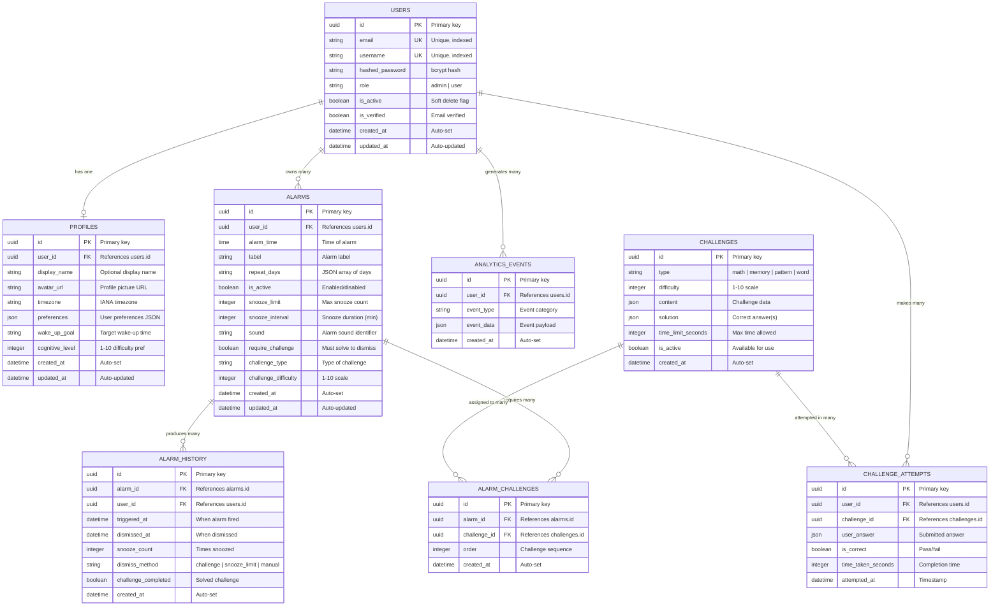

# 🗄️ Database Design Documentation

## Intelligent Cognitive Alarm Platform (ICAP)

---

## 1. Entity-Relationship Diagram



---

## 2. Table Schemas

### 2.1 `users` — Core User Accounts

| Column            | Type          | Constraints                         | Description                  |
| ----------------- | ------------- | ----------------------------------- | ---------------------------- |
| `id`              | `UUID`        | `PK`, `DEFAULT gen_random_uuid()`   | Unique identifier            |
| `email`           | `VARCHAR(255)`| `NOT NULL`, `UNIQUE`, `INDEX`       | User email address           |
| `username`        | `VARCHAR(100)`| `NOT NULL`, `UNIQUE`, `INDEX`       | Display username             |
| `hashed_password` | `VARCHAR(255)`| `NOT NULL`                          | bcrypt-hashed password       |
| `role`            | `VARCHAR(20)` | `NOT NULL`, `DEFAULT 'user'`        | `admin` or `user`            |
| `is_active`       | `BOOLEAN`     | `NOT NULL`, `DEFAULT TRUE`          | Soft delete flag             |
| `is_verified`     | `BOOLEAN`     | `NOT NULL`, `DEFAULT FALSE`         | Email verification status    |
| `created_at`      | `TIMESTAMP`   | `NOT NULL`, `DEFAULT NOW()`         | Record creation time         |
| `updated_at`      | `TIMESTAMP`   | `NOT NULL`, `DEFAULT NOW()`         | Last update time             |

### 2.2 `profiles` — User Profiles & Preferences

| Column            | Type          | Constraints                         | Description                  |
| ----------------- | ------------- | ----------------------------------- | ---------------------------- |
| `id`              | `UUID`        | `PK`, `DEFAULT gen_random_uuid()`   | Unique identifier            |
| `user_id`         | `UUID`        | `FK → users.id`, `UNIQUE`, `INDEX`  | Owning user                  |
| `display_name`    | `VARCHAR(150)`| `NULLABLE`                          | Optional display name        |
| `avatar_url`      | `VARCHAR(500)`| `NULLABLE`                          | Profile picture URL          |
| `timezone`        | `VARCHAR(50)` | `DEFAULT 'UTC'`                     | IANA timezone identifier     |
| `preferences`     | `JSONB`       | `DEFAULT '{}'`                      | User preferences object      |
| `wake_up_goal`    | `VARCHAR(10)` | `NULLABLE`                          | Target wake-up time (HH:MM)  |
| `cognitive_level` | `INTEGER`     | `DEFAULT 5`, `CHECK 1-10`           | Preferred difficulty level   |
| `created_at`      | `TIMESTAMP`   | `NOT NULL`, `DEFAULT NOW()`         | Record creation time         |
| `updated_at`      | `TIMESTAMP`   | `NOT NULL`, `DEFAULT NOW()`         | Last update time             |

### 2.3 `alarms` — Alarm Definitions *(Milestone 2)*

| Column                | Type          | Constraints                         | Description                  |
| --------------------- | ------------- | ----------------------------------- | ---------------------------- |
| `id`                  | `UUID`        | `PK`, `DEFAULT gen_random_uuid()`   | Unique identifier            |
| `user_id`             | `UUID`        | `FK → users.id`, `INDEX`            | Owning user                  |
| `alarm_time`          | `TIME`        | `NOT NULL`                          | Alarm trigger time           |
| `label`               | `VARCHAR(200)`| `DEFAULT ''`                        | User-defined label           |
| `repeat_days`         | `JSONB`       | `DEFAULT '[]'`                      | Days of week (0=Mon, 6=Sun)  |
| `is_active`           | `BOOLEAN`     | `NOT NULL`, `DEFAULT TRUE`          | Alarm enabled/disabled       |
| `snooze_limit`        | `INTEGER`     | `DEFAULT 3`, `CHECK >= 0`           | Max snooze count             |
| `snooze_interval`     | `INTEGER`     | `DEFAULT 5`, `CHECK >= 1`           | Snooze duration in minutes   |
| `sound`               | `VARCHAR(100)`| `DEFAULT 'default'`                 | Sound identifier             |
| `require_challenge`   | `BOOLEAN`     | `DEFAULT TRUE`                      | Must solve to dismiss        |
| `challenge_type`      | `VARCHAR(50)` | `NULLABLE`                          | Preferred challenge type     |
| `challenge_difficulty` | `INTEGER`    | `DEFAULT 5`, `CHECK 1-10`           | Challenge difficulty level   |
| `created_at`          | `TIMESTAMP`   | `NOT NULL`, `DEFAULT NOW()`         | Record creation time         |
| `updated_at`          | `TIMESTAMP`   | `NOT NULL`, `DEFAULT NOW()`         | Last update time             |

### 2.4 `challenges` — Challenge Library *(Milestone 3)*

| Column              | Type          | Constraints                         | Description                  |
| ------------------- | ------------- | ----------------------------------- | ---------------------------- |
| `id`                | `UUID`        | `PK`, `DEFAULT gen_random_uuid()`   | Unique identifier            |
| `type`              | `VARCHAR(50)` | `NOT NULL`, `INDEX`                 | Challenge category           |
| `difficulty`        | `INTEGER`     | `NOT NULL`, `CHECK 1-10`, `INDEX`   | Difficulty rating            |
| `content`           | `JSONB`       | `NOT NULL`                          | Challenge data payload       |
| `solution`          | `JSONB`       | `NOT NULL`                          | Correct answer(s)            |
| `time_limit_seconds`| `INTEGER`     | `DEFAULT 60`                        | Max allowed time             |
| `is_active`         | `BOOLEAN`     | `NOT NULL`, `DEFAULT TRUE`          | Available for use            |
| `created_at`        | `TIMESTAMP`   | `NOT NULL`, `DEFAULT NOW()`         | Record creation time         |

### 2.5 `challenge_attempts` — User Attempt Records *(Milestone 3)*

| Column              | Type          | Constraints                         | Description                  |
| ------------------- | ------------- | ----------------------------------- | ---------------------------- |
| `id`                | `UUID`        | `PK`, `DEFAULT gen_random_uuid()`   | Unique identifier            |
| `user_id`           | `UUID`        | `FK → users.id`, `INDEX`            | Attempting user              |
| `challenge_id`      | `UUID`        | `FK → challenges.id`, `INDEX`       | Challenge attempted          |
| `user_answer`       | `JSONB`       | `NOT NULL`                          | Submitted answer             |
| `is_correct`        | `BOOLEAN`     | `NOT NULL`                          | Whether answer was correct   |
| `time_taken_seconds`| `INTEGER`     | `NOT NULL`                          | Time spent solving           |
| `attempted_at`      | `TIMESTAMP`   | `NOT NULL`, `DEFAULT NOW()`         | When attempt was made        |

### 2.6 `alarm_history` — Alarm Event Log *(Milestone 4)*

| Column               | Type          | Constraints                         | Description                  |
| -------------------- | ------------- | ----------------------------------- | ---------------------------- |
| `id`                 | `UUID`        | `PK`, `DEFAULT gen_random_uuid()`   | Unique identifier            |
| `alarm_id`           | `UUID`        | `FK → alarms.id`, `INDEX`           | Alarm that fired             |
| `user_id`            | `UUID`        | `FK → users.id`, `INDEX`            | User who received alarm      |
| `triggered_at`       | `TIMESTAMP`   | `NOT NULL`                          | When alarm triggered         |
| `dismissed_at`       | `TIMESTAMP`   | `NULLABLE`                          | When alarm was dismissed     |
| `snooze_count`       | `INTEGER`     | `DEFAULT 0`                         | Number of snoozes used       |
| `dismiss_method`     | `VARCHAR(50)` | `NULLABLE`                          | How alarm was dismissed      |
| `challenge_completed`| `BOOLEAN`     | `DEFAULT FALSE`                     | Whether challenge was solved |
| `created_at`         | `TIMESTAMP`   | `NOT NULL`, `DEFAULT NOW()`         | Record creation time         |

### 2.7 `analytics_events` — Event Tracking *(Milestone 4)*

| Column        | Type          | Constraints                         | Description                  |
| ------------- | ------------- | ----------------------------------- | ---------------------------- |
| `id`          | `UUID`        | `PK`, `DEFAULT gen_random_uuid()`   | Unique identifier            |
| `user_id`     | `UUID`        | `FK → users.id`, `INDEX`            | User who generated event     |
| `event_type`  | `VARCHAR(100)`| `NOT NULL`, `INDEX`                 | Event category               |
| `event_data`  | `JSONB`       | `DEFAULT '{}'`                      | Event payload                |
| `created_at`  | `TIMESTAMP`   | `NOT NULL`, `DEFAULT NOW()`, `INDEX`| Event timestamp              |

---

## 3. Relationships

| Relationship              | Type         | Description                                              |
| ------------------------- | ------------ | -------------------------------------------------------- |
| User → Profile            | One-to-One   | Each user has exactly one profile                        |
| User → Alarms             | One-to-Many  | A user can create multiple alarms                        |
| User → Challenge Attempts | One-to-Many  | A user can make many challenge attempts                  |
| User → Analytics Events   | One-to-Many  | A user generates many analytics events                   |
| Alarm → Alarm Challenges  | One-to-Many  | An alarm can require multiple challenges                 |
| Challenge → Alarm Challenges | One-to-Many | A challenge can be assigned to multiple alarms         |
| Alarm → Alarm History     | One-to-Many  | An alarm can fire many times, each producing a record    |
| Challenge → Challenge Attempts | One-to-Many | A challenge can be attempted by many users           |

### Cascade Rules

| Parent Table | Child Table         | ON DELETE      | Reason                                     |
| ------------ | ------------------- | -------------- | ------------------------------------------ |
| `users`      | `profiles`          | `CASCADE`      | Profile has no meaning without user         |
| `users`      | `alarms`            | `CASCADE`      | User's alarms should be removed             |
| `users`      | `challenge_attempts`| `CASCADE`      | Historical data removed with user           |
| `users`      | `analytics_events`  | `CASCADE`      | Analytics data removed with user            |
| `alarms`     | `alarm_challenges`  | `CASCADE`      | Challenge assignments removed with alarm    |
| `alarms`     | `alarm_history`     | `CASCADE`      | History removed with alarm                  |
| `challenges` | `alarm_challenges`  | `RESTRICT`     | Prevent deleting challenges in use          |
| `challenges` | `challenge_attempts`| `SET NULL`     | Preserve attempt records, nullify reference |

---

## 4. Indexes & Performance

### 4.1 Primary Indexes

| Table                | Index                          | Columns              | Type   | Purpose                     |
| -------------------- | ------------------------------ | -------------------- | ------ | --------------------------- |
| `users`              | `ix_users_email`               | `email`              | UNIQUE | Login lookup                |
| `users`              | `ix_users_username`            | `username`           | UNIQUE | Username lookup             |
| `profiles`           | `ix_profiles_user_id`          | `user_id`            | UNIQUE | User → profile lookup       |
| `alarms`             | `ix_alarms_user_id`            | `user_id`            | INDEX  | User's alarms listing       |
| `alarms`             | `ix_alarms_user_active`        | `user_id, is_active` | INDEX  | Active alarms for user      |
| `challenge_attempts` | `ix_attempts_user_id`          | `user_id`            | INDEX  | User's attempt history      |
| `challenge_attempts` | `ix_attempts_challenge_id`     | `challenge_id`       | INDEX  | Challenge statistics        |
| `alarm_history`      | `ix_history_user_triggered`    | `user_id, triggered_at` | INDEX | User's alarm timeline    |
| `analytics_events`   | `ix_analytics_user_created`    | `user_id, created_at`| INDEX  | User event timeline         |
| `analytics_events`   | `ix_analytics_event_type`      | `event_type`         | INDEX  | Event type aggregation      |
| `challenges`         | `ix_challenges_type_difficulty` | `type, difficulty`  | INDEX  | Challenge selection queries |

### 4.2 Performance Considerations

1. **UUID Primary Keys** — Use `gen_random_uuid()` (PostgreSQL) for distributed-safe IDs. Slightly less performant than sequential IDs for B-tree indexes, but eliminates ID collision concerns.

2. **JSONB Columns** — Used for flexible schema fields (`preferences`, `content`, `solution`, `event_data`). GIN indexes can be added when query patterns emerge.

3. **Timestamp Indexes** — `created_at` columns on high-volume tables (`analytics_events`, `alarm_history`) are indexed for time-range queries.

4. **Partial Indexes** — Consider partial indexes for common query patterns:
   ```sql
   CREATE INDEX ix_alarms_active ON alarms (user_id) WHERE is_active = TRUE;
   CREATE INDEX ix_challenges_active ON challenges (type, difficulty) WHERE is_active = TRUE;
   ```

5. **Connection Pooling** — SQLAlchemy configured with pool size 5, max overflow 10 to prevent connection exhaustion under load.

---

## 5. Migration Strategy

### 5.1 Tools

- **Alembic** for schema migrations, integrated with SQLAlchemy
- Migrations are version-controlled in `backend/alembic/versions/`

### 5.2 Workflow

```bash
# Generate a new migration from model changes
alembic revision --autogenerate -m "description of changes"

# Review the generated migration file
# Edit if needed (especially for data migrations)

# Apply migrations
alembic upgrade head

# Rollback one step
alembic downgrade -1

# View migration history
alembic history

# View current revision
alembic current
```

### 5.3 Migration Conventions

| Convention                  | Rule                                                      |
| --------------------------- | --------------------------------------------------------- |
| Naming                      | `YYYYMMDD_HHMM_description.py` (auto-generated)          |
| Review                      | Always review autogenerated migrations before applying    |
| Data migrations             | Create separate migrations for data-only changes          |
| Destructive changes         | Use multi-step migrations (add new → migrate data → drop) |
| Testing                     | Run migrations against a test database before production  |

---

## 6. Future Tables (Planned)

### Milestone 2 — Alarms
- `alarms` — Alarm definitions and schedules
- `alarm_challenges` — Alarm-to-challenge mappings

### Milestone 3 — Challenges
- `challenges` — Challenge library
- `challenge_attempts` — User attempt records

### Milestone 4 — Analytics
- `alarm_history` — Alarm trigger/dismiss events
- `analytics_events` — General event tracking

### Milestone 5+ — Extended Features
- `notifications` — Notification queue and delivery status
- `user_achievements` — Gamification badges and milestones
- `social_connections` — Friend/accountability partner links
- `challenge_ratings` — User ratings for challenges
