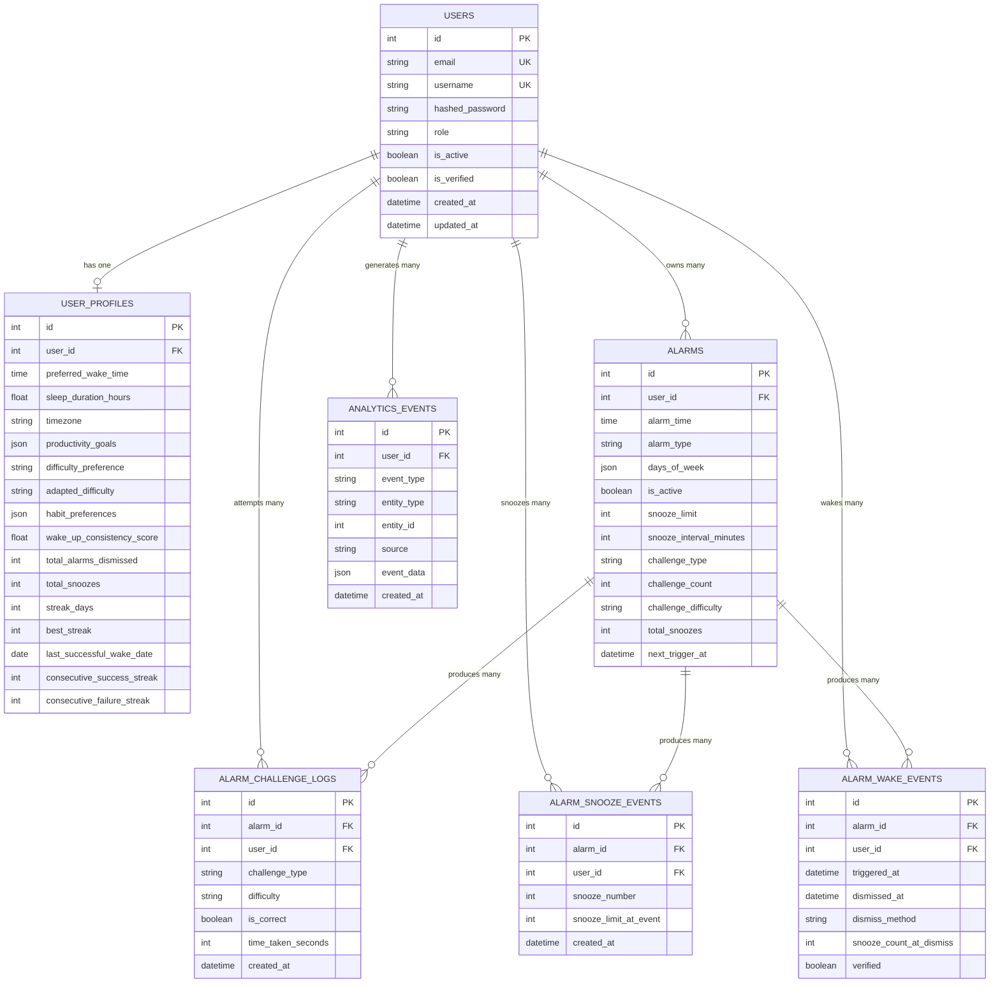

# 🗄️ Database Design Documentation

## Intelligent Cognitive Alarm Platform (ICAP)

> **Status note (Milestone 3):** Challenge attempts, wake/snooze audit logs, analytics ingestion, and adaptive-difficulty streak counters are **implemented**. Challenges are generated at runtime (no static `challenges` library table). Habit scores and recommendations are **computed** (plus Redis cache), not stored as dedicated tables.

---

## 1. Entity-Relationship Diagram



---

## 2. Table Schemas

### 2.1 `users` — Core User Accounts

| Column            | Type           | Constraints                   | Description               |
| ----------------- | -------------- | ----------------------------- | ------------------------- |
| `id`              | `INTEGER`      | `PK`, autoincrement           | Unique identifier         |
| `email`           | `VARCHAR(255)` | `NOT NULL`, `UNIQUE`, `INDEX` | User email address        |
| `username`        | `VARCHAR(100)` | `NOT NULL`, `UNIQUE`, `INDEX` | Display username          |
| `hashed_password` | `VARCHAR(255)` | `NOT NULL`                    | bcrypt-hashed password    |
| `role`            | `VARCHAR(20)`  | `NOT NULL`, default `user`    | `admin` or `user`         |
| `is_active`       | `BOOLEAN`      | `NOT NULL`, default `TRUE`    | Soft delete flag          |
| `is_verified`     | `BOOLEAN`      | `NOT NULL`, default `FALSE`   | Email verification status |
| `created_at`      | `TIMESTAMP`    | `NOT NULL`                    | Record creation time      |
| `updated_at`      | `TIMESTAMP`    | `NOT NULL`                    | Last update time          |

### 2.2 `user_profiles` — Preferences & Habit Counters *(Milestone 3)*

| Column                        | Type          | Constraints              | Description                                      |
| ----------------------------- | ------------- | ------------------------ | ------------------------------------------------ |
| `id`                          | `INTEGER`     | `PK`                     | Unique identifier                                |
| `user_id`                     | `INTEGER`     | `FK → users.id`, unique  | Owning user                                      |
| `preferred_wake_time`         | `TIME`        | nullable                 | Target wake-up time                              |
| `sleep_duration_hours`        | `FLOAT`       | default `8.0`            | Target sleep duration                            |
| `timezone`                    | `VARCHAR(50)` | default `UTC`            | IANA timezone                                    |
| `productivity_goals`          | `JSON`        | nullable                 | Goal list                                        |
| `difficulty_preference`       | `ENUM`        | default `medium`         | User-controlled preference (`beginner`…`expert`); never auto-modified |
| `adapted_difficulty`          | `ENUM`        | default `medium`         | Adaptive working level (±1); reset to preference on manual change    |
| `habit_preferences`           | `JSON`        | nullable                 | Habit-related prefs                              |
| `wake_up_consistency_score`   | `FLOAT`       | default `0`              | Rolling consistency (0–100)                      |
| `total_alarms_dismissed`      | `INTEGER`     | default `0`              | Lifetime verified dismissals                     |
| `total_snoozes`               | `INTEGER`     | default `0`              | Lifetime snooze count                            |
| `streak_days`                 | `INTEGER`     | default `0`              | Current consecutive calendar-day wake streak     |
| `best_streak`                 | `INTEGER`     | default `0`              | Best Day Streak ever                             |
| `last_successful_wake_date`   | `DATE`        | nullable                 | Local date of last verified successful wake      |
| `consecutive_success_streak`  | `INTEGER`     | default `0`              | Success Streak: consecutive successful wake completions (+1 on verified dismiss only; reset on final wake failure only; never reset by adaptive threshold) |
| `consecutive_failure_streak`  | `INTEGER`     | default `0`              | Consecutive failed wake completions (adaptive lowering) |

### 2.3 `alarms` — Alarm Definitions *(Milestone 2)*

| Column                     | Type          | Constraints     | Description                          |
| -------------------------- | ------------- | --------------- | ------------------------------------ |
| `id`                       | `INTEGER`     | `PK`            | Unique identifier                    |
| `user_id`                  | `INTEGER`     | `FK → users.id` | Owning user                          |
| `alarm_time`               | `TIME`        | `NOT NULL`      | Alarm trigger time                   |
| `alarm_type`               | `ENUM`        | `NOT NULL`      | daily / weekday / weekend / …        |
| `days_of_week`             | `JSON`        | nullable        | Custom day list                      |
| `is_active`                | `BOOLEAN`     | default `TRUE`  | Enabled/disabled                     |
| `snooze_limit`             | `INTEGER`     | default `3`     | Max snoozes per cycle                |
| `snooze_interval_minutes`  | `INTEGER`     | default `5`     | Snooze duration                      |
| `challenge_type`           | `ENUM`        | default random  | Preferred challenge type             |
| `challenge_count`          | `INTEGER`     | default `1`     | Challenges required to dismiss       |
| `challenge_difficulty`     | `VARCHAR(50)` | default medium  | Baseline difficulty for this alarm   |
| `total_snoozes`            | `INTEGER`     | default `0`     | Snoozes in current wake cycle        |
| `next_trigger_at`          | `TIMESTAMP`   | nullable        | Next scheduled fire                  |

### 2.4 `alarm_challenge_logs` — Challenge Attempt Log *(Milestone 3)*

Runtime-generated challenges; each verify attempt is logged here (SSOT for adaptive difficulty / puzzle accuracy).

| Column               | Type          | Constraints      | Description                |
| -------------------- | ------------- | ---------------- | -------------------------- |
| `id`                 | `INTEGER`     | `PK`             | Unique identifier          |
| `alarm_id`           | `INTEGER`     | `FK → alarms.id` | Parent alarm               |
| `user_id`            | `INTEGER`     | `FK → users.id`  | Attempting user            |
| `challenge_type`     | `VARCHAR(50)` | `NOT NULL`       | Normalized type            |
| `difficulty`         | `VARCHAR(50)` | `NOT NULL`       | Effective difficulty       |
| `challenge_prompt`   | `TEXT`        | `NOT NULL`       | Prompt shown               |
| `is_correct`         | `BOOLEAN`     | `NOT NULL`       | Pass/fail                  |
| `time_taken_seconds` | `INTEGER`     | default `0`      | Solve time                 |
| `failed_attempts`    | `INTEGER`     | default `0`      | Prior wrongs in cycle      |
| `points_earned`      | `INTEGER`     | default `0`      | Points awarded             |
| `created_at`         | `TIMESTAMP`   | `NOT NULL`       | Attempt timestamp          |

**Indexes:** `(user_id, created_at)`, `(alarm_id, created_at)`.

### 2.5 `alarm_snooze_events` — Per-Snooze Audit *(Milestone 2/3)*

| Column                  | Type        | Constraints      | Description                         |
| ----------------------- | ----------- | ---------------- | ----------------------------------- |
| `id`                    | `INTEGER`   | `PK`             | Unique identifier                   |
| `user_id`               | `INTEGER`   | `FK → users.id`  | User                                |
| `alarm_id`              | `INTEGER`   | `FK → alarms.id` | Alarm                               |
| `snooze_number`         | `INTEGER`   | `NOT NULL`       | 1-based ordinal in current cycle    |
| `snooze_limit_at_event` | `INTEGER`   | `NOT NULL`       | Limit snapshot at snooze time       |
| `next_trigger_at`       | `TIMESTAMP` | nullable         | Rescheduled ring time               |
| `created_at`            | `TIMESTAMP` | `NOT NULL`       | Event time                          |

### 2.6 `alarm_wake_events` — Verified Wake Cycles *(Milestone 2/3)*

| Column                    | Type          | Constraints      | Description                              |
| ------------------------- | ------------- | ---------------- | ---------------------------------------- |
| `id`                      | `INTEGER`     | `PK`             | Unique identifier                        |
| `user_id`                 | `INTEGER`     | `FK → users.id`  | User                                     |
| `alarm_id`                | `INTEGER`     | `FK → alarms.id` | Alarm                                    |
| `triggered_at`            | `TIMESTAMP`   | `NOT NULL`       | Ring start                               |
| `dismissed_at`            | `TIMESTAMP`   | nullable         | Verified dismiss time                    |
| `dismiss_method`          | `VARCHAR(50)` | nullable         | `challenge` / `snooze_exhausted` / …     |
| `challenges_required`     | `INTEGER`     | default `1`      | Required puzzle count                    |
| `challenges_completed`    | `INTEGER`     | default `0`      | Completed puzzles                        |
| `snooze_count_at_dismiss` | `INTEGER`     | default `0`      | Snoozes used this cycle                  |
| `verified`                | `BOOLEAN`     | default `FALSE`  | Whether dismiss was verified             |

### 2.7 `analytics_events` — Telemetry Ingestion *(Milestone 3)*

Additive event store; domain logs remain SSOT for habit score / adaptive difficulty.

| Column        | Type           | Constraints     | Description                          |
| ------------- | -------------- | --------------- | ------------------------------------ |
| `id`          | `INTEGER`      | `PK`            | Unique identifier                    |
| `user_id`     | `INTEGER`      | `FK → users.id` | User                                 |
| `event_type`  | `VARCHAR(100)` | `NOT NULL`      | e.g. `alarm.snoozed`                 |
| `entity_type` | `VARCHAR(50)`  | nullable        | Optional entity class                |
| `entity_id`   | `INTEGER`      | nullable        | Optional entity id                   |
| `source`      | `VARCHAR(20)`  | default server  | `server` / `client` / `system`       |
| `event_data`  | `JSON`         | default `{}`    | Payload                              |
| `created_at`  | `TIMESTAMP`    | `NOT NULL`      | Event timestamp                      |

---

## 3. Relationships

| Relationship                 | Type        | Description                                      |
| ---------------------------- | ----------- | ------------------------------------------------ |
| User → Profile               | One-to-One  | Each user has one `user_profiles` row            |
| User → Alarms                | One-to-Many | A user owns many alarms                          |
| User → Challenge Logs        | One-to-Many | Attempt history for adaptive difficulty / scores |
| User → Snooze / Wake Events  | One-to-Many | Behavioral analytics inputs                      |
| User → Analytics Events      | One-to-Many | Ingested telemetry                               |
| Alarm → Challenge / Snooze / Wake | One-to-Many | Per-alarm audit trail                       |

### Cascade Rules

| Parent   | Child                    | ON DELETE | Reason                              |
| -------- | ------------------------ | --------- | ----------------------------------- |
| `users`  | `user_profiles`          | `CASCADE` | Profile meaningless without user    |
| `users`  | `alarms`                 | `CASCADE` | Remove owned alarms                 |
| `users`  | `analytics_events`       | `CASCADE` | Remove telemetry with user          |
| `alarms` | `alarm_challenge_logs`   | `CASCADE` | Attempts removed with alarm         |

---

## 4. Indexes & Performance

| Table                  | Index / columns                         | Purpose                              |
| ---------------------- | --------------------------------------- | ------------------------------------ |
| `alarm_challenge_logs` | `(user_id, created_at)`                 | Adaptive difficulty + history        |
| `alarm_challenge_logs` | `(alarm_id, created_at)`                | Per-alarm history                    |
| `alarm_snooze_events`  | `(user_id, created_at)`                 | Snooze pattern analytics             |
| `analytics_events`     | `(user_id, created_at)`, `event_type`   | Ingestion queries / summaries        |

**Not persisted as tables (by design):**
- Habit score — computed via `habit_score.py`
- Recommendations — computed + Redis-cached (`recommendation_cache.py`)

---

## 5. Migration Strategy

### 5.1 Tools

- **Alembic** for schema migrations, integrated with SQLAlchemy
- Migrations are version-controlled in `backend/alembic/versions/`

### 5.2 Relevant Milestone 3 migrations

| Migration                              | Purpose                                      |
| -------------------------------------- | -------------------------------------------- |
| `20260716_attempt_log_audit.py`        | Snooze events + challenge-log indexes        |
| `20260716_analytics_ingestion.py`      | `analytics_events` table                     |
| `20260720_adaptive_streak_counters.py` | Profile consecutive success/failure streaks  |

### 5.3 Workflow

```bash
alembic revision --autogenerate -m "description of changes"
alembic upgrade head
alembic downgrade -1
alembic history
alembic current
```

---

## 6. Future Tables (Planned)

### Milestone 5+ — Extended Features
- `notifications` — Notification queue and delivery status
- `user_achievements` — Gamification badges and milestones
- `social_connections` — Friend/accountability partner links

### Explicitly not planned (superseded)
- `challenges` / `challenge_attempts` / `alarm_challenges` static library — replaced by runtime generators + `alarm_challenge_logs`
- `alarm_history` — covered by `alarm_wake_events` + `alarm_snooze_events`
